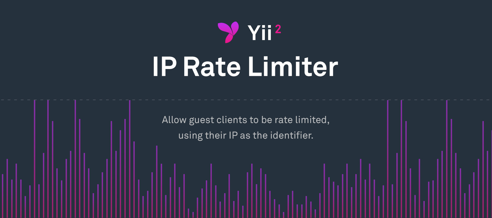

# yii2-ip-ratelimiter
Allow guest clients to be rate limited, using their IP as the identifier.

## Installation

The preferred way to install this extension is through [composer](http://getcomposer.org/download/).

Either run

```
php composer.phar require andreyv/yii2-ip-ratelimiter "2.*"
```

or add

```
"andreyv/yii2-ip-ratelimiter": "2.*"
```

to the require section of your `composer.json` file.

## Usage

Modify the bahavior method of the controller you want to rate limit

```
public function behaviors()
{
    $behaviors = parent::behaviors();
    $behaviors['rateLimiter'] = [
        // Use class
        'class' => \andreyv\ratelimiter\IpRateLimiter::class,

        // The maximum number of allowed requests
        'rateLimit' => 100,

        // The time period for the rates to apply to
        'timePeriod' => 600,

        // Separate rate limiting for guests and authenticated users
        // Defaults to false
        // - false: use one set of rates, whether you are authenticated or not
        // - true: use separate ratesfor guests and authenticated users
        'separateRates' => true,

        // Whether to return HTTP headers containing the current rate limiting information
        'enableRateLimitHeaders' => false,

        // Array of actions on which to apply ratelimiter, if empty - applies to all actions
        'actions' => ['index'],

        // Allows to skip rate limiting for test environment
        'testMode' => true,
        // Defines whether proxy enabled, list of headers getting from request ipHeaders. By default ['X-Forwarded-For']
        'proxyEnabled' => false
    ];
    return $behaviors;
}
```

Forked from ethercreative/yii2-ip-ratelimiter.
